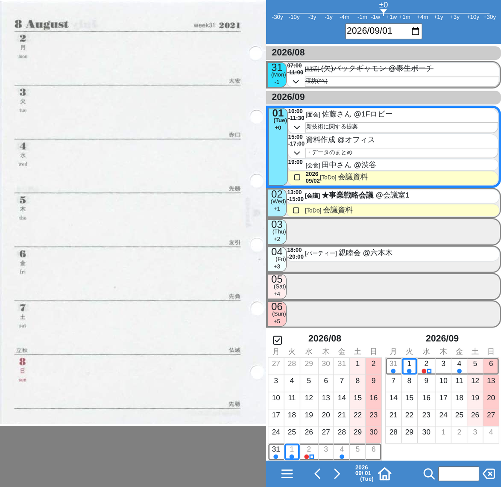

# YT Scheduler



システム手帳(1ページ一週間のタイプ)のリフィルをイメージして、
手帳の柔軟性とスマホの使い勝手を活かし、
「自分にとって」最高に使いやすいスケジュール帳を目指してます。


## 主な特徴

* 自分専用！ 人に見せるものではない！

  - スケジュールの共有や公開などは、一切考えないため、シンプル。

* スケジュールだけでなく、ToDo、日記、メモなど、
  何でも手軽に書き込める。

* スマホの使い勝手を活かす。

  - 1 画面に 1 週間。左右のスワイプで週を送る
  - 検索機能、フィルター機能
  - スペースを気にせず、たくさん書き込める

* フッターの ◀▶ をダブルタップすると、自動でページを送り続ける。

  - もう一度タップするか、画面の他の場所をタップすると止まる。
  - ページを送る間隔は調整可能。

* フィルター機能

  - フィルター文字列にマッチするスケジュールのみ表示する。
  - フィルター文字列の先頭に「!」をつけると「not」の意味になり、
    非表示にすることも可能。
  - プライバシー保護などにも有効

* ToDoの期限が近づくと(あるいは期限をすぎると)、
  今日の予定として表示される。
  
  - 何日以内の ToDo を今日の予定として表示するかは、調整可能。

* 画面の上部に横向きのゲージを表示

  - 表示されているスケジュールが
    「今日から」どれぐらい離れているか直感的にわかりやすい。
  - ゲージをタップすると、その位置の週へ飛べる。

* 曜日ごとに色を変えているので、曜日感覚がつかみやすい。


### 仕組み(つくり)の特徴

* ユーザー認証(ID, パスワード)やクライアント認証(証明書)は、
  リバースプロキシに任せる！
  
  - 単一ユーザだからこそ。
  - この方が、本ソフト自体のセキュリティホールや脆弱性の問題を
    最小限に抑えられる。

* (あえて)既存のデータベース(SQLなど)は使わず、
  潰しが効くテキスト形式(JSON Lines)のデータ。
  
  - 個人の情報量なら、数十年分のスケジュールを
    メモリ上にキャッシング可能で、パフォーマンスも問題ない。

  - データベースでも通常はバックアップしたり、
    エクスポートしたりできるが、
    時代とともにデータベースそのものの仕様が大きく変わったり、
    スキーマを大きく変更する可能性を考えると、
    加工しやすいテキスト形式ファイルの方が扱いやすい。

  - 実際、10年以上前に、Perl CGIで作成したデータも、
    `ytsched migrate` で変換して使えるようにしている
    (形式は [docs/data-format.md](docs/data-format.md) を参照)。


## 基本ルール

* 太字強調

  タイトルに「!」「★」をつけると「重要」の意味(太字強調される)

* 取り消し

  タイトルの先頭に「(欠)」、「(キャンセル)」などをつけると、
  「取り消し」の意味 (取り消し線が入る)

* ToDo

  タイプを「□」にすると、「ToDo」項目と見なす


## 課題・問題点

* 検索機能は、改良の必要あり。

  - 検索結果の表示方法はどうするのがいいのか？
  - 数十年分のデータを、いかに効率よく検索するか？

* 期間スケジュール、繰り返しスケジュール

  - 手書きの手帳と同様、繰り返し書き込む必要がある。

  - 現状では、繰り返し登録がなるべくしやすいように
    UIを工夫して対応するしかない。


## 使用環境

### クライアント = スマホ、タブレット、PC

Google Chrome ブラウザ


### サーバ

OS: Linux, FreeBSD
言語: Python 3.14 以上（[uv](https://docs.astral.sh/uv/) でインストール）


### セキュリティのためのリバースプロキシ: Nginx, Apacheなど

* SSL
* Basic認証
* クライアント証明書


## Install

### インストール

Python 3.14 以上と [uv](https://docs.astral.sh/uv/) が必要。

```sh
git clone https://github.com/ytani01/ytsched.git
cd ytsched
uv tool install .
```

`~/.local/bin/ytsched` にコマンドが入る。

```sh
ytsched webapp --datadir ~/ytsched/data --port 10085
```

更新するときは、リポジトリを `git pull` したうえで、
以下のどちらかを実行する。

```sh
uv tool install --reinstall .   # リポジトリのカレントディレクトリから
uv tool upgrade ytsched         # どこからでも実行できる
```


### systemd --user への登録

ログイン中だけでなく常駐させたい場合は、systemd --user のユニットを
作る。ポートや `--datadir` は環境ごとに違うため、リポジトリには
含めていない。`~/.config/systemd/user/ytsched.service` として、
次の内容で作成する。

```ini
[Unit]
Description=YT Scheduler (ytsched) web server
Documentation=https://github.com/ytani01/ytsched
After=network-online.target
Wants=network-online.target

[Service]
Type=simple
ExecStart=%h/.local/bin/ytsched webapp --datadir %h/ytsched/data --port 10085
Restart=on-failure
RestartSec=5
KillSignal=SIGINT
TimeoutStopSec=10

[Install]
WantedBy=default.target
```

作成したら、有効化して起動する。

```sh
systemctl --user daemon-reload
systemctl --user enable --now ytsched.service
```

状態とログの確認。

```sh
systemctl --user status ytsched.service
journalctl --user -u ytsched.service -f
```

停止・再起動・自動起動の解除。

```sh
systemctl --user restart ytsched.service
systemctl --user stop ytsched.service
systemctl --user disable --now ytsched.service
```

ログインしていない間も動かし続けたい場合（サーバ用途では通常こちら）は、
lingering を有効にする。

```sh
sudo loginctl enable-linger $USER
```


## 設定

データディレクトリ直下の `conf.json` に入る。検索語や絞り込みなど、
画面で操作した内容は自動的に保存されるので、ふだん触る必要はない。

手で書くのは次の 2 つ。アプリは読むだけなので、書いた値が消えることは
ない。値は**文字列で**書く。リクエストのたびに読み直すので、再起動は
要らない。

| キー | 既定 | 範囲 | 意味 |
|------|------|------|------|
| `LoadMonths` | 1 | 0〜24 | 前後何ヶ月ぶんの週を HTML に含めるか。多いほどページを読み直さずに動ける代わりに、最初の表示が重くなる |
| `AutoTurnMsec` | 700 | 300〜10000 | 自動ページ送りの間隔（ミリ秒） |

```json
{"LoadMonths": "2", "AutoTurnMsec": "500"}
```

読めない値（数字にならない、範囲の外）は、警告を出して既定値で動く。


## 外部のライブラリ

**使っていません。** 外部の CDN も読まないので、ネットワークが届かない
環境でも表示は崩れません。

CSS は `src/ytsched/webroot/static/css/my.css` 1 つだけです。土台の指定
（`body` のフォント・文字色・行の高さ、`box-sizing` など）は Bootstrap
5.3.8（MIT License）から写したもので、ライセンス文書は
[docs/licenses/bootstrap-LICENSE](docs/licenses/bootstrap-LICENSE) に
置いてあります。

アイコンは自作の線画で、`src/ytsched/webroot/static/icons/icons.svg` に
`<symbol>` としてまとめ、画面からは `<use>` で参照しています。


## スマホのホーム画面に追加する

アイコンは独自のデザインで、元は 1 つの SVG
（`src/ytsched/webroot/static/icons/icon.svg`）です。ImageMagick が
入っていれば、`tools/make-icons.sh` で PNG と ICO を作り直せます。

`manifest.json` も同梱しているので、スマホのブラウザで開いてホーム画面に
追加すると、単体のアプリのように開きます。`start_url` は相対パスなので、
`--urlprefix` を変えても付いてきます。


## 開発者向け

コードの構成や開発ツールの使い方は [docs/Developer.md](docs/Developer.md)
を、データの保存形式は [docs/data-format.md](docs/data-format.md) を
見てください。
