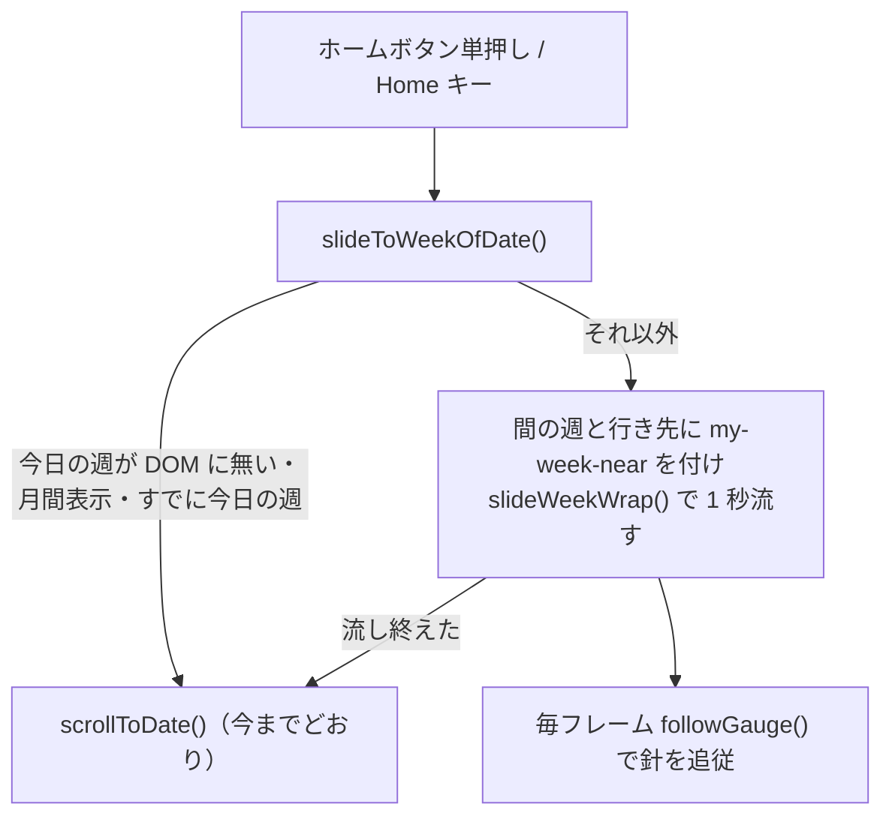

# TODO-217. ホームで今日の週へ戻るとき、横に速く流す

|      | main | 担当 |
|------|------|------|
| 見込み | Opus 5.5 / effort medium | main（実装）+ reviewer（Opus 5.5 / high）+ verifier（Sonnet 5.5 / medium） |
| 実施 | Opus 5.5 / effort medium | main（実装）+ reviewer（Opus 5.5 / high、3 回）+ verifier（Sonnet 5.5 / medium、4 回） |

| 担当 | モデル | effort | input | output | cache_creation | cache_read | 割合 |
|------|--------|--------|-------|--------|----------------|------------|------|
| main | Opus 5.5 | medium | 182 | 43,390 | 87,917 | 9,928,081 | 73% |
| verifier | Sonnet 5.5 | medium | 74 | 387 | 126,351 | 1,794,377 | 14% |
| reviewer | Opus 5.5 | high | 56 | 14,593 | 282,913 | 1,539,441 | 13% |
| 合計 |  |  | 312 | 58,370 | 497,181 | 13,261,899 | 計 13,817,762 |

- reviewer・verifier とも定義のモデルのまま（opus / sonnet）。2 回目以降は同じ担当に続けて頼んだ
- verifier の output が 387 と小さいのは、`subagents/` のログが途中経過しか拾えないため（少なめに出る）

## きっかけ

ホームボタンで今日の週へ戻るとき、`setActiveWeek()` で一瞬で切り替わり、
どれだけ離れていたかが分からなかった。利用者から、横に速く流してほしい、
離れているうちは速く、今日の週に近づくにつれて遅くしたい、流している間は
ゲージも同期させたい、という依頼があった。

## やったこと

ホームボタン（単押し）とキーの Home で、今日の週が DOM にあれば、間の週も
見せながら 1 秒で横に流してから、今までどおり `scrollToDate()` で移る。

- `week.js`
  - `slideToWeekOfDate()` を足した。間の週と行き先の週に `my-week-near` を付け、
    `-rel × 画面幅` まで流す。流している間は `requestAnimationFrame` で
    `.my-week-wrap` の位置を読み、ゲージの針を追従させる
  - `slideWeekWrap()` に transition のクラスと長さの引数を足した
    （既定は今までの `my-week-wrap-sliding` / 200ms）
  - 取り消しの経路として `isSliding()` / `finishSlide()`（外へ出す）と
    `cancelSlide()`（中だけ）を足した。`setActiveWeek()` は先頭で取り消す
- `gauge.js`: `followGauge(date_str, weeks)` を足した。transition を外して
  針を小数の週の位置に置き、ラベルは近い週へ丸めて数え下げる。ドラッグ中は触らない
- `my.css`: `.my-week-wrap-homing`（`transform 1s cubic-bezier(0.1, 0.9, 0.2, 1)`）
- `main-page.js` / `keyboard.js`: 単押しと Home キーを `slideToWeekOfDate()` 経由に。
  ダブルタップでは、流している途中なら元の週に並べ直してから読み直す
- `nav.js`: `scrollToDate()` と `popstateHdr()` は、流している途中なら同じ週でも
  `setActiveWeek()` を通す（流し終えた先で上書きされないように）
- `swipe.js`: 流している途中にドラッグを始めたら、`finishSlide()` で行き先まで
  済ませてから追従する

時間は最初 0.35 秒にしたが、利用者の指示で 1 秒にした。

## 確かめたこと

verifier が Playwright（390×844）で実測した（`archives/agents/TODO-217/`
の `verifier-report*.md`、スクリプトは `verify_home_slide*.py`）。

- 4 週先・4 週前から流すと、transform が減速しながら行き先へ動き、中間の週が
  映る。終わると今日の週・URL・`my-week-near` が揃い、transition のクラスは残らない
- 針は今週へ単調に近づき、ラベルは -4w → ±0 と数え下がる
- 流している途中のゲージのクリック・`history.back()` で、選んだ週が上書きされない
- 流している途中のドラッグで編集画面へ行かず、今日の週から向きどおりに送られる
- 応答を 1.5 秒遅らせたダブルタップで、読み直し後の今週になり、元のページの
  状態も流す前に戻っている
- すでに今日の週・月間表示・◀▶ の 0.2s は変わらない。コンソールのエラーは 0 件
- `mise run lint` が通り、`mise run test` は 720 passed

利用者もスマホの実機で動きを見た。

## 残ること

- DOM の中で流す経路を通る自動テストは無い（reviewer の指摘。実測で確かめた）
- JS を変えたら、サーバーの再起動が要る。Tornado の `static_url` は版のハッシュを
  プロセスの中で覚えているので、再起動しないとブラウザが古い JS をキャッシュから読む
  （確認中に実際に起きた）

## 分担の振り返り

- **reviewer**: 1 回目で、行き先の週に `my-week-near` が付かず空白が見える件
  （要修正）と、ゲージのクリックなどで直に移ったとき、あとから今日の週で上書きされる件を
  見つけた。2 回目で、元の週へ戻る操作が取り消されない件・流している途中のスワイプ・
  ドラッグ中の針を挙げた。3 回目で、ダブルタップで元のページに食い違った状態が残る件
  （bfcache）を見つけた
- **verifier**: 流している途中のドラッグが、マウスでは離したときにクリックになって
  編集画面へ行く件を実測で見つけた。reviewer が「追従を見送る」形を検討として出し、
  main がそのとおりに直した結果で、静的なレビューでは捕まらなかった
- **見込みとの食い違い**: 担当の組み方は見込みどおり。往復が reviewer 3 回・
  verifier 4 回に増えたのは、途中で利用者の依頼（1 秒・針の追従）が加わったことと、
  取り消しの経路の直しが 1 回で収まらなかったため
- **次に同じ規模なら**: アニメーションを足す項目では、最初の依頼から reviewer に
  「流している途中に別の操作が重なる経路」を全部挙げさせ、main が直す前に
  取り消しの方針（取り消す・済ませる・無視する）を操作ごとに決める。そうすれば、
  直す → 測る → 別の経路が出る、の往復を 1〜2 回減らせる。verifier に渡す
  ドラッグの確認は、マウスとタッチで扱いが違う（マウスは追従しないとクリックになる）
  ので、マウスの経路を必ず入れる
