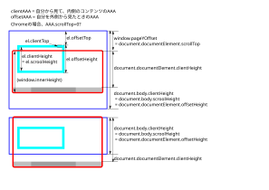

# 開発者向けドキュメント

開発環境の用意、開発ツールの使い方、テストとログの決まりをまとめる。
利用者向けの説明は [../README.md](../README.md) と
[User.md](User.md)、導入と運用は [Install.md](Install.md)、
ソースコードの構成は
[../src/README.md](../src/README.md)、テストの構成は
[../tests/README.md](../tests/README.md)、データ形式は
[data-format.md](data-format.md) を見ること。

## 1. 技術スタック

| もの | 何のためか |
| --- | --- |
| Python 3.14 | 実行環境。`pyproject.toml` の `requires-python` で固定 |
| [uv](https://docs.astral.sh/uv/) | パッケージ管理・仮想環境・実行（`uv run` / `uv sync` / `uv build`） |
| [tornado](https://www.tornadoweb.org/) | Web サーバとテンプレートエンジン |
| [click](https://click.palletsprojects.com/) | CLI（`ytsched` コマンド）の組み立て |
| [loguru](https://github.com/Delgan/loguru) | ログ（`mylog.py` がラップしている） |
| [pytest](https://docs.pytest.org/) | テスト |
| [ruff](https://docs.astral.sh/ruff/) | フォーマットと lint |
| [basedpyright](https://docs.basedpyright.com/) / [mypy](https://mypy-lang.org/) | 型チェック（2 つともかける） |
| [mise](https://mise.jdx.dev/) | タスクランナー（`mise.toml`） |
| [ESLint](https://eslint.org/) | JavaScript の lint |
| [Prettier](https://prettier.io/) | JavaScript の整形 |
| [Node.js](https://nodejs.org/) | ESLint・Prettier の実行環境。`mise.toml` の `[tools]` で固定 |

## 2. 外部のライブラリ

**画面側では使っていない。** 外部の CDN も読まないので、ネットワークが
届かない環境でも表示は崩れない。

CSS は `src/ytsched/webroot/static/css/my.css` 1 つだけ。クラス名は
テンプレートの要素ごとの役割で付けてあり、`container-fluid` や `row`
のような Bootstrap 由来の名前は残っていない。土台の指定
（`body` のフォント・文字色・行の高さ、`box-sizing` など）と、
役割クラスの中の一部の値は Bootstrap 5.3.8（MIT License）から写した
もので、ライセンス文書は
[licenses/bootstrap-LICENSE](licenses/bootstrap-LICENSE) に置いてある。

アイコンは自作の線画で、`src/ytsched/webroot/static/icons/icons.svg` に
`<symbol>` としてまとめ、画面からは `<use>` で参照している。元は 1 つの
SVG（`src/ytsched/webroot/static/icons/icon.svg`）で、ImageMagick が
入っていれば `tools/make-icons.sh` で PNG と ICO を作り直せる。
ホーム画面に追加したときのアイコンはこれを使う。

## 3. 開発環境の用意

Python 3.14 以上と uv があれば足りる。

```sh
git clone https://github.com/ytani01/ytsched.git
cd ytsched
uv sync
```

`uv sync` で `dependency-groups.dev`（pytest・ruff・basedpyright・mypy
など）も一緒に入る。以降のコマンドは `uv run` 経由か、`mise run` で
タスクとして叩く。

`.js` の lint（ESLint）と整形（Prettier）には Node.js と npm パッケージが
要る。Node.js は `mise install` で `mise.toml` の `[tools]` に書いた
バージョンが入る。パッケージは `npm install`（CI なら `npm ci`）で入れる。

```sh
mise install
npm install
```

## 4. mise のタスク

`mise.toml` に定義がある。`build` は `test` に、`test` は `lint` に、
`lint` は `fmt` と `fmtjs` と `typecheck` と `lintjs` に依存する。

```sh
mise run fmt        # ruff format / ruff check --fix
mise run fmtjs      # Prettier（.js）
mise run typecheck  # basedpyright / mypy
mise run lintjs     # ESLint（.js）
mise run lint       # fmt と fmtjs と typecheck と lintjs
mise run test       # pytest（lint に依存）
mise run build      # uv build（test に依存）
```

アプリを動かすタスクもある。引数は `--` のあとに書く（mise が行の末尾へ
足す）。

```sh
mise run webapp                            # ~/ytsched/data・port 10085
mise run webapp -- --datadir /tmp/x --port 10099
mise run migrate -- --dry-run
mise run tokens -- TODO-046                # TODO 項目ごとのトークン消費量
mise run shot -- --open                    # 画面を撮る
mise run figs                              # 図に注釈を重ねる
```

`upgradeproject`（`uppj`）は依存を上げ直すタスクで、`lint` などからは
呼ばれていない（**どこからも依存されていない**）。`rm -f uv.lock` →
`uv sync` → `uv pip install -U` が走るので、上げ直したいときに明示的に
叩く。

## 5. 個別コマンドで実行する場合

```sh
uv run pytest tests
uv run ruff format src tests tools
uv run ruff check --fix src tests tools
uv run basedpyright src tests tools
uv run mypy src tests tools
npx prettier --write src/ytsched/webroot/static/js
npx eslint src/ytsched/webroot/static/js
```

アプリの起動:

```sh
uv run ytsched webapp --datadir ~/ytsched/data --port 10085
```

旧形式（タブ区切り `.cgi`）から JSON Lines への移行
（`ytsched migrate`、オプションは [data-format.md](data-format.md) 参照）:

```sh
uv run ytsched migrate --datadir ~/ytsched/data
```

旧形式から移ってきた `sde_id`（`{UUID}-{版}` の形でない）をこの形へ
振り直す（`ytsched fix-id`、TODO-171）。対象は日々のファイル・
`ToDo.jsonl`・`trash.jsonl`。元に戻せないので、まず `--dry-run` で
件数を確かめること:

```sh
uv run ytsched fix-id --datadir ~/ytsched/data --dry-run
uv run ytsched fix-id --datadir ~/ytsched/data
```

日本の祝日の取得・登録（`ytsched holiday`、TODO-126）:

```sh
uv run ytsched holiday 2028 2029 --datadir ~/ytsched/data
```

| オプション | 内容 |
| --- | --- |
| `--datadir` | データディレクトリ。既定は `~/ytsched/data` |
| `--dry-run` | 書き出さずに、足す件数だけ出す |
| `--url` | 取得元の URL。既定は内閣府の CSV（`https://www8.cao.go.jp/chosei/shukujitsu/syukujitsu.csv`） |
| `--debug` / `-d` | デバッグログ |

年は 1 つ以上の引数で受ける（省くとエラー）。重なりの判定は、**同じ日付で
`title` も一致する予定があれば飛ばす**（`type` は見ない）。指定した年が
CSV に無ければ、その年は「データが無い」と報告して飛ばし、他の年は続ける。

その日の予定と期限の近い ToDo をテキストで出す（`ytsched notify`、
TODO-153）:

```sh
uv run ytsched notify --datadir ~/ytsched/data
```

| オプション | 内容 |
| --- | --- |
| `--datadir` | データディレクトリ。既定は `~/ytsched/data` |
| `--date` | 対象の日（`YYYY-MM-DD`）。既定は今日 |
| `--no-todo` | 期限の近い ToDo を出さない |
| `--days` | 対象の日を含めて何日ぶんの予定を出すか。既定は 1 |
| `--memo` | メッセージの先頭に出す文言。既定は無し |

標準出力へテキストを出すだけで、Slack へは送らない。送るのは
別の道具（`~/bin/slack-send.sh`）に任せ、cron から次のようにつなぐ:

```sh
0 7 * * * $HOME/.local/bin/ytsched notify | $HOME/bin/slack-send.sh -c '#ytsched' -t 'ytsched'
```

予定も期限の近い ToDo も無い日も、日付行と「予定なし」は必ず出す。
期限の近さは `SchedDataEnt.todo_urgency()` の `over`/`near`
（期限切れ、または 7 日以内）で判定する。

`--days` を 2 以上にすると、`--date` の日から連続した日ぶんの節を
続けて出し、期限の近い ToDo の節は全体の最後に 1 回だけ出す
（`--date` の日を基準に判定する）。

## 6. 画面を撮る

見た目を変えたときは、テストだけでは確かめられない。`tools/screenshot.py`
で画面を撮る（TODO-046）。**先にアプリを起動しておくこと。実データを
汚さないよう、確かめるときは `--datadir` に一時ディレクトリを指定する。**

```sh
uv run ytsched webapp --datadir /tmp/x --port 10085 &
mise run shot -- --open -p todo046
```

保存先は既定で `~/tmp/playwright-mcp/`、ファイル名は
`{prefix}_{closed|open}_{幅}.png`。幅は既定で 412px（スマホ）と 800px の
2 つで、`-w` を複数回渡せば変えられる。`--open` を付けると、詳細（detail）
のような開閉するものを開いた状態も撮る（開くものは `--toggle` で指定。
既定は `input.my-longtext-sw`）。

`--scale` にデバイスピクセル比を渡すと、レイアウトは `-w` の幅のまま、
画像だけが指定の倍率で大きくなる（TODO-151）。文書へ貼る図を作るときに
使う。

- 撮る URL は既定で `http://localhost:10085/ytsched/`。`--urlprefix` の
  既定（`/ytsched`）に合わせてある。一覧は `/` にも割り当ててあるので
  どちらでも出るが、編集画面は前置きが無いと 404 になる。位置引数で
  変えられる（`mise run shot -- http://localhost:10086/`）
- playwright は dev 依存に入っている（TODO-056 でブラウザを動かす
  テストを足したときに入れた）。`uv sync` すれば `mise run shot` も
  そのまま動く
- ブラウザはシステムの `/usr/bin/chromium` を使う。
  `~/.cache/ms-playwright` にあるビルドは playwright-mcp が入れたもので、
  `--with playwright` が取ってくる版とは合わず起動しない（TODO-045）
- **HTTP のステータスが 200 以外なら、撮らずに終了コード 1 で終える**
  （TODO-053）。URL を間違えて 404 のページを撮ってしまい、変更の前後の
  突き合わせで見分けが付かなくなるのを防ぐため。

  ```sh
  $ mise run shot -- http://localhost:10085/edit/
  404: http://localhost:10085/edit/
  URL を確かめる。
  $ echo $?
  1
  ```

## 7. 図に注釈を入れる

`docs/User.md` に貼っている画面図は、撮ったキャプチャに `tools/annotate.py`
で引き出し線と吹き出しを重ねたもの（TODO-152）。キャプチャを HTML に貼り、
吹き出しを絶対位置で並べ、引き出し線を SVG で引いて、chromium で撮り直す。

```sh
mise run shot -- -w 412 --height 853 --scale 2 -p week   # 元のキャプチャ
mise run figs                                            # 注釈を重ねる
mise run figs -- --only user-week -o /tmp/try            # 1 枚だけ試す
```

注釈の位置は `tools/user-figs.json` に書いてある。指し示す点（`to`）と
吹き出しの左上（`at`）は、**どちらも画像の左上を原点とした px**。画面を
撮り直したら、同じ JSON でもう一度流せばよい。書き方は
`tools/annotate.py` の docstring にある。

`docs/User.md` の図を作り直す手順は
[../archives/todo/TODO-152. User.md に画面図を入れる.md](../archives/todo/TODO-152.%20User.md%20に画面図を入れる.md)
に残してある（サンプルデータ、撮る URL、それぞれの高さ）。

## 8. テストの走らせ方

`tests/` はいずれも `uv run pytest tests`（または `mise run test`）で
まとめて動く。各テストファイルが何を見ているか、`helpers.py` の役割、
ゴールデンマスターテストの位置づけは [../tests/README.md](../tests/README.md)
を見ること。

`test_browser.py` だけはブラウザを起動する（TODO-056）。`pytest` は
`static/js/` のスクリプトを実行しないので、JavaScript の不具合は
それ以外のテストでは捕まらない。

- **他のテストと同じ `mise run test` で一緒に走る。** playwright は
  dev 依存に入れてあるので、`uv sync` のほかに用意するものは無い
- ブラウザはシステムの `/usr/bin/chromium` を使う（`mise run shot` と
  同じ理由。TODO-045）。無ければ skip する
- テストごとに `ytsched webapp` を空いている port で起動し、`--datadir`
  には `tmp_path` を渡す。実データ（`~/ytsched/data`）には触れない
- 1 件だけ走らせるときは
  `uv run pytest tests/test_browser.py -v`。ブラウザの動きを目で見たい
  ときは、`page` fixture の `launch()` に `headless=False` を足す

移行元（旧形式）の合成テストデータを作り直したいときは、
`uv run python tests/make_test_data.py` を実行する。

## 9. ログの書き方

`mylog.py` のラッパを使う。標準の `logging` は使わない。クラス本体に
`__log = getLogger(__qualname__)` を 1 つ置く。

```python
from .mylog import getLogger


class SchedDataEnt:
    # クラス本体に置く（アンダースコア2つ）。__qualname__ はクラス名。
    __log = getLogger(__qualname__)

    def is_todo(self):
        self.__log.debug("SchedDataEnt.is_todo")
```

クラスの無いモジュール（`main` など）は、モジュール先頭に
`_log = getLogger("main")` のように置く。詳しいサンプルは
`src/ytsched/mylog.py` の docstring にある。

## 10. memo

### 10.1 JavaScript `Date` の罠

`new Date()` の日付の区切り文字が
`/` だと JST（+09:00）、`-` だと UTC とみなされる。

```
> (new Date("2021/01/01")).toISOString();
"2020-12-31T15:00:00.000Z"
> (new Date("2021-01-01")).toISOString();
"2021-01-01T00:00:00.000Z"
```

### 10.2 JavaScript scroll・size 関連


