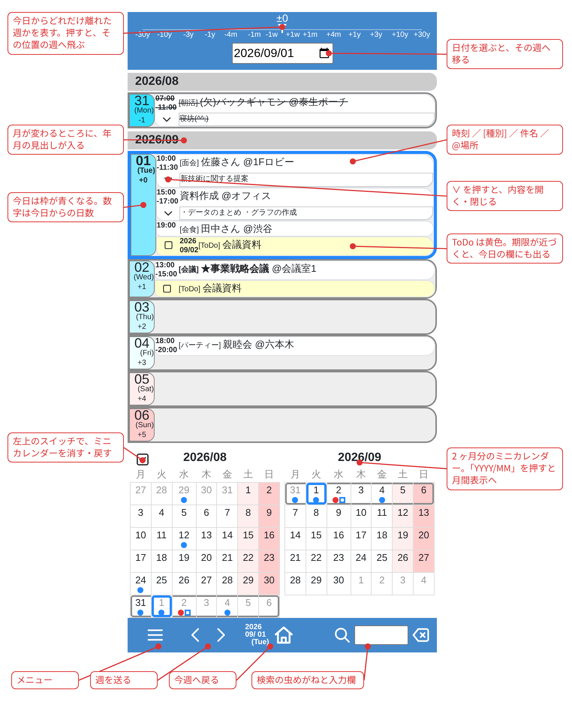
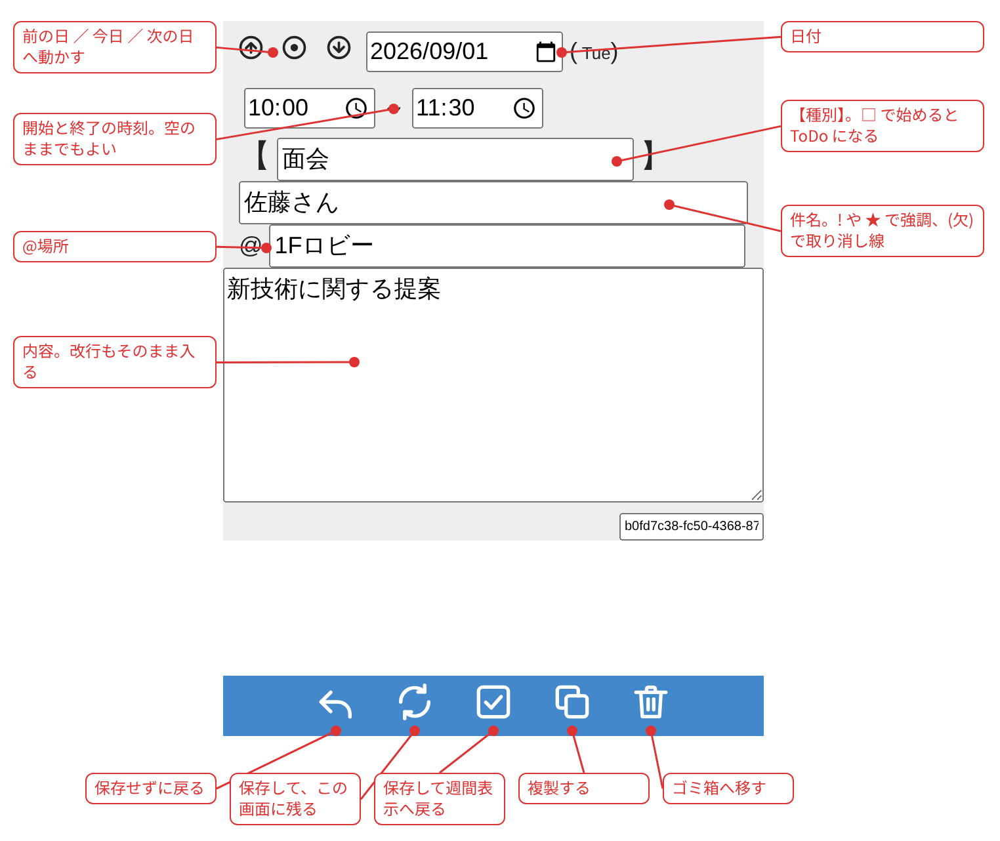
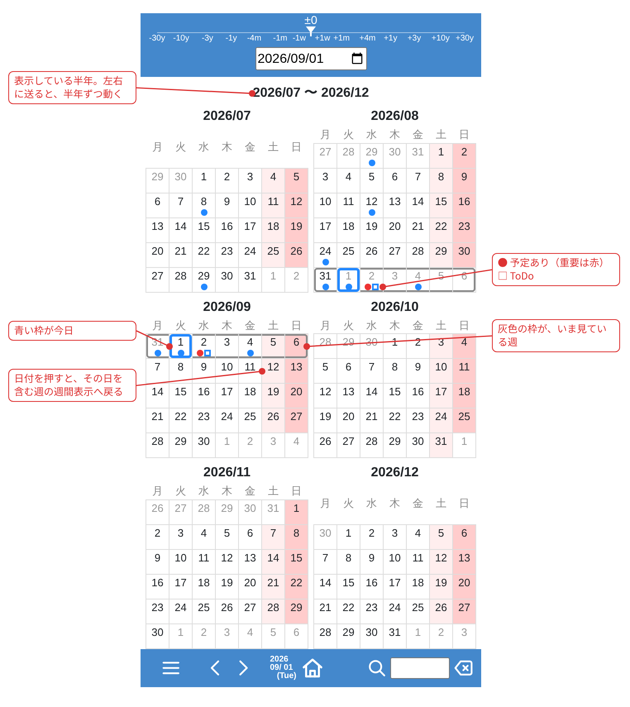
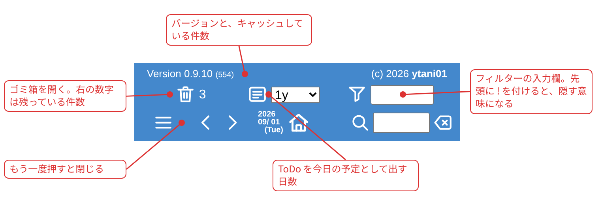
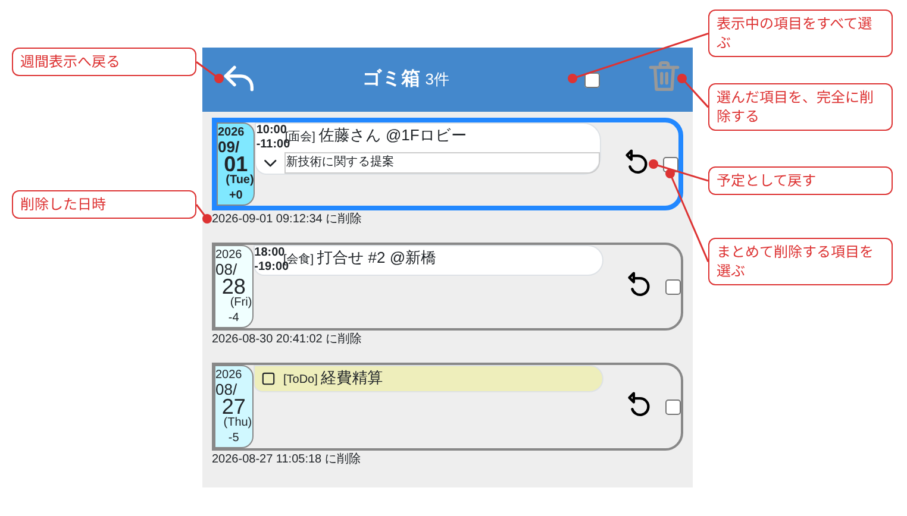
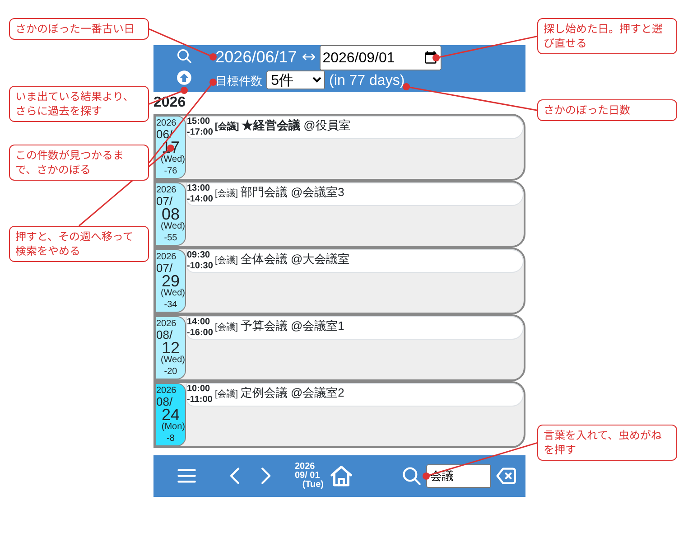

# ユーザーズマニュアル(使い方)

画面の使い方と設定をまとめる。全体の紹介は [../README.md](../README.md)、
導入と運用は [Install.md](Install.md)、開発者向けの説明は
[Developer.md](Developer.md) を見ること。

画面はスマホで使う前提で作ってある。図はスマホの幅（412px）で撮ったもの。

## 1. 週の表示

最初に出るのがこの画面。1 画面に 1 週間。



左右のスワイプ（PC ならマウスの左右ドラッグ）で週を送る。
フッターの ◀▶ でも送れる。**◀▶ をダブルタップすると自動で送り続け**、
もう一度タップするか画面の他の場所をタップすると止まる。

画面上部の横向きのゲージは、表示している週が今日からどれぐらい離れて
いるかを表す。**ゲージを押すと、その位置の週へ飛ぶ。**
フッターの家のアイコンで今週の月曜へ戻る。

日付の欄か予定の行を押すと、編集画面が開く。

## 2. 書き方の基本ルール

* **太字強調**

  タイトルに「!」「★」をつけると「重要」の意味（太字で強調される）。

* **取り消し**

  タイトルの先頭に「(欠)」「(キャンセル)」などをつけると「取り消し」の
  意味（取り消し線が入る）。

* **ToDo**

  タイプを「□」にすると ToDo 項目と見なす。期限が近づくと（あるいは
  期限を過ぎると）、今日の予定としても表示される。何日以内のものを
  出すかは、メニューの日数の欄で変えられる。

* **連番の予定**

  タイトルの末尾が半角の `#` と数字（例: `打合せ #3`）になっていると、
  編集画面の複製ボタンで、日付が翌日・番号が +1 された予定ができる。
  ToDo は日付を動かさず、番号だけ +1 する。

## 3. 編集画面

週の表示で日付か予定を押すと開く。



日付・時刻・種別・件名・場所・内容を入れて、下のボタンで決める。

- **戻る**（左向きの矢印）… 保存せずに週の表示へ戻る
- **更新**（回る矢印）… 保存して、この画面に残る
- **完了**（チェック）… 保存して週の表示へ戻る
- **複製**（重なった四角）… 同じ内容の予定をもう 1 件作る。連番の予定は
  日付が翌日、番号が +1 になる
- **削除**（ゴミ箱）… ゴミ箱へ移す

日付の左にある 3 つのボタンは、日付を前の日・今日・次の日へ動かす。

## 4. 月間ミニカレンダー

日曜日の下に 2 ヶ月分のミニカレンダーが出る。左上のスイッチで表示を
消したり戻したりできる（消しているときもスイッチは残る）。
設定は保存されるので、次に開いたときもそのまま。

## 5. 月間表示

ミニカレンダーの「YYYY/MM」を押すと、その月を含む半年（1〜6月・
7〜12月のどちらか）のミニカレンダーを 6 つ、2 列 × 3 行で並べた
月間表示になる。



日付を押すと、その日を含む週の週間表示に戻る。

左右のスワイプ（PC ならマウスの左右ドラッグ）・フッターの ◀▶・
キーボードの ← → は、月間表示では半年単位で移動する。検索中は
月間表示にならず、週間表示のまま残る。

## 6. メニュー

フッター左端の三本線を押すと、下からパネルが出る。もう一度三本線を
押すと閉じる。



- ゴミ箱アイコン（右の数字は、ゴミ箱に残っている件数）
- ToDo を今日の予定として出す日数の選択
- フィルターの入力欄
- バージョンと、キャッシュしている件数

## 7. フィルター

フィルター文字列にマッチする予定だけを表示する。先頭に「!」をつけると
「not」の意味になり、マッチするものを隠せる。人に画面を見せるときの
目隠しにも使える。入力欄はメニューの中にある。

## 8. ゴミ箱

削除した予定は消えずにゴミ箱に残る。編集も内部では「削除してから追加」
なので、編集前の内容も残る。メニューのゴミ箱アイコンから開く。



* 各項目の復活ボタン（左へ回る矢印）で、その内容を予定として戻す
* チェックボックスで表示中の項目を選び、ヘッダーのゴミ箱アイコンから
  まとめて完全に削除できる。全選択も表示中の項目だけが対象になる
* 表示する件数は設定の `TrashMax` で変えられる（既定 100）

## 9. 検索

### 9.1 検索を始める

画面下部のバーの右側に、虫めがねのアイコンと入力欄がある。

1. 入力欄に探したい言葉を入れる
2. 虫めがねを押す

すると画面が検索結果に切り替わり、見つかった予定だけが日付順に並ぶ。

入力欄の右にある「消しゴム」のアイコンは、**入力欄を空にするだけ**で、
検索は実行しない。検索をやめるときは、空にしたうえで虫めがねを押す。

### 9.2 どこを探すか

予定の **種別・件名・場所・内容** をまとめた文字列から探す。
大文字と小文字は区別しない（全角の括弧は半角として扱う）。

言葉は**正規表現**として解釈される。ふつうの言葉をそのまま入れれば
そのまま探せるが、`(` や `*` などの記号は特別な意味を持つ。
書き方が正しくないときは、画面の上に
「検索の正規表現が正しくないので、検索していません」と出る。

先頭の記号で場所を絞ることもできる。

| 入れる言葉 | 探すもの |
| --- | --- |
| `会議` | どこかに「会議」を含む予定 |
| `@新宿` | 場所が「新宿」の予定 |
| `\+打合せ` | 件名が「打合せ」で始まる予定 |

`#` `+` `@` は、種別・件名・場所・内容をつないだ 1 本の文字列の中の
区切りの目印。内容にたまたま同じ並びが書いてあれば、それにも当たる。

### 9.3 検索結果の画面



上部のバーに、探した期間と目標件数が出る。**目標件数**は
1・2・3・4・5・10・20・50・100 件から選ぶ。変えるとその場で探し直す。

### 9.4 左上のボタン — もっと前を探す

虫めがねと上向きの丸を重ねたボタン。**いま出ている結果より、さらに
過去を探す**。

押すと、いま出ている結果の**一番古い日**を新しい起点にして、そこから
また過去へさかのぼる。押すたびに、どんどん昔へたどれる。

- 1 回で戻る日数は決まっていない。予定が多い時期は少ししか戻らず、
  少ない時期は大きく戻る（日数ではなく件数で区切るため）
- さかのぼれるのは**約 5 年前まで**。ただし 1 件でも見つかっていれば、
  1 年より前には行かずに止まる
- 検索した言葉はそのまま残るので、続けて何度でも押せる
- **逆（未来）へ進むボタンは無い。** 行きすぎたときは、上部の右の
  日付を指定し直す

### 9.5 検索をやめる

次のどちらかで、ふつうの週表示に戻る。

- 検索結果の**左端の日付**を押す — その日を含む週へ移り、検索を解除する
- 入力欄を空にして虫めがねを押す

画面下部の**ホーム**（家のアイコン）では検索は解除されない。
**検索したまま**今週の月曜へ移る。

## 10. スマホのホーム画面に追加する

`manifest.json` を同梱しているので、スマホのブラウザで開いてホーム画面に
追加すると、単体のアプリのように開く。`start_url` は相対パスなので、
`--urlprefix` を変えても付いてくる。

## 11. 設定

データディレクトリ直下の `conf.json` に入る。検索語や絞り込みなど、
画面で操作した内容は自動的に保存されるので、ふだん触る必要はない。

手で書くのは次の 3 つ。アプリは読むだけなので、書いた値が消えることは
ない。値は**文字列で**書く。リクエストのたびに読み直すので、再起動は
要らない。

| キー | 既定 | 範囲 | 意味 |
|------|------|------|------|
| `LoadMonths` | 1 | 0〜24 | 前後何ヶ月ぶんの週を HTML に含めるか。多いほどページを読み直さずに動ける代わりに、最初の表示が重くなる |
| `AutoTurnMsec` | 700 | 300〜10000 | 自動ページ送りの間隔（ミリ秒） |
| `TrashMax` | 100 | 1 以上 | ゴミ箱に表示する件数 |

```json
{"LoadMonths": "2", "AutoTurnMsec": "500", "TrashMax": "200"}
```

読めない値（数字にならない、範囲の外）は、警告を出して既定値で動く。

## 12. 毎朝の通知

cron などで設定されていれば、毎朝その日の予定と期限の近い ToDo を
Slack へ通知できる。予定も ToDo も無い日も必ず 1 通届く。設定は
アプリの利用者ではなく管理者が行う。

cron の設定例（毎朝 7 時、Slack への送信は
[slack-send](https://github.com/ytani01/slack-send) に任せる）。

```
0 7 * * * $HOME/.local/bin/ytsched notify | $HOME/bin/slack-send.sh -c '#ytsched' -t 'ytsched'
```
