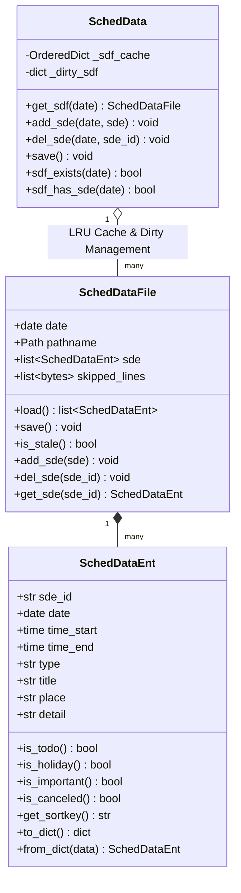
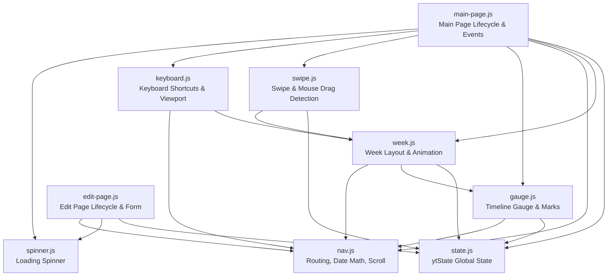
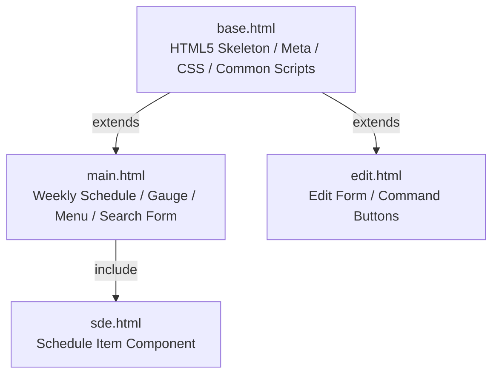

# ytsched コード全体レビュー

本ドキュメントは、個人用スケジュール管理Webアプリケーション **ytsched** のコード全体（Python、JavaScript、CSS、HTML）を対象に、細かい構文やスタイルの指摘にとどまらず、**全体的な構造・アーキテクチャ、役割分担、クラス構成、コンポーネント間の連携**を重点的にレビューした記録である。

---

## 1. 全体アーキテクチャとシステム構成

### 1.1 システム概要と設計思想
ytsched は、単一ユーザ向けのスケジュール・ToDo管理Webアプリケーションである。Python 3.14、Tornado、JSON Lines形式を基盤とし、認証をリバースプロキシに委譲する割り切った設計を採用している。

主要な設計思想として以下の特徴が見られる：
- **ローカルファースト / 堅牢な永続化**: データはローカルの JSON Lines ファイル群（日付別・ToDo別）で管理され、ファイル破損時の自動退避・復元機構（`skipped_lines`）や安全なバックアップ（`.bak`）を備える。
- **POST-Redirect-GET (PRG) パターン**: 変更操作はすべて POST で受け取り、`conf.json` やデータファイルへの保存を完了した後に日付クエリ付きの GET へリダイレクトすることで、再読み込み時の二重送信を防ぐ。
- **クライアントサイドでの軽快な週移動**: 1リクエストで前後数ヶ月分の週データを DOM に展開し、JavaScript による DOM 差し替え・CSS Grid/Transform アニメーションによって、ページ再読み込みなしで即座に週送りを行う。

### 1.2 全体レイヤ構造

```mermaid
graph TD
    subgraph Client [ブラウザ / フロントエンド]
        HTML[Tornado Templates<br/>base / main / edit / sde.html]
        CSS[CSS<br/>my.css: CSS Grid & Custom Components]
        JS[JavaScript 9 Modules<br/>state / week / nav / gauge / swipe / keyboard ...]
    end

    subgraph WebServer [Web / ハンドラ層 (Tornado)]
        WS[webapp.WebServer<br/>Application Assembly]
        HB[handler.HandlerBase<br/>AppInfo / ConfFile Management]
        MH[main_handler.MainHandler<br/>Weekly View & Command Dispatch]
        EH[edit_handler.EditHandler<br/>Edit Form View]
    end

    subgraph Domain [ドメイン / ビジネスロジック層 (Tornado非依存)]
        SL[sched_load.SchedLoader<br/>Week Loading & Search]
        SU[sched_update.SchedUpdater<br/>Add / Update / Fix / Delete]
        CF[conf.ConfFile<br/>Cached conf.json IO]
        HU[handler_util<br/>Validation & Pure Functions]
    end

    subgraph DataModel [データモデル / 永続化層]
        SD[ytsched.SchedData<br/>LRU Cache & Dirty File Manager]
        SDF[ytsched.SchedDataFile<br/>Per-Day / ToDo File IO & Backup]
        SDE[ytsched.SchedDataEnt<br/>Schedule / ToDo Entity]
    end

    subgraph Storage [ファイルシステム]
        JSONL[~/ytsched/data/*.jsonl]
        CONF[~/ytsched/data/conf.json]
    end

    JS -->|HTTP GET/POST| WebServer
    HTML -->|Rendered via| WebServer
    WS --> HB
    HB --> MH
    HB --> EH
    MH --> SL
    MH --> SU
    MH --> CF
    MH --> HU
    EH --> CF
    EH --> HU
    SL --> SD
    SU --> SD
    SD --> SDF
    SDF --> SDE
    SDF --> JSONL
    CF --> CONF
```

---

## 2. バックエンド (Python) の構造・クラス構成レビュー

### 2.1 モジュール構成と役割分担

| モジュール | 主なクラス・関数 | 役割と責務 |
| :--- | :--- | :--- |
| [`ytsched.py`](file:///home/ytani/work/ytsched/src/ytsched/ytsched.py) | `SchedDataEnt`<br/>`SchedDataFile`<br/>`SchedData` | データモデル層。エンティティの表現、ファイル単位の I/O と壊れた行の退避、日付ごとの LRU キャッシュおよび未保存ファイルの一括書き込み（`save`）。 |
| [`handler.py`](file:///home/ytani/work/ytsched/src/ytsched/handler.py) | `HandlerBase`<br/>`AppInfo` | Webハンドラの基底クラス。URL 登録時に渡された `sd`, `app_info`, `conf` の保持、`conf.json` のリクエスト単位のリフレッシュと終了時保存（`on_finish`）。 |
| [`conf.py`](file:///home/ytani/work/ytsched/src/ytsched/conf.py) | `ConfFile` | `conf.json` のキャッシュ付き読み書き（Tornado非依存）。外部変更の検知（`is_stale`）と安全な書き込み。 |
| [`handler_util.py`](file:///home/ytani/work/ytsched/src/ytsched/handler_util.py) | `convert_value`<br/>`str2date` 等 | 純粋関数群。リクエスト引数や設定値の型変換・日付範囲チェック。 |
| [`main_handler.py`](file:///home/ytani/work/ytsched/src/ytsched/main_handler.py) | `MainHandler`<br/>`ConfArgs` | 一覧画面の描画、コマンド（add/fix/update/del）の受付とリダイレクト制御、正規表現コンパイル、週データ配列の生成。 |
| [`sched_load.py`](file:///home/ytani/work/ytsched/src/ytsched/sched_load.py) | `SchedLoader`<br/>`SchedLoadCond`<br/>`MonthCal` 等 | スケジュールの読み集め（Tornado非依存）。週間表示（`load_week`）、過去への検索（`search`）、月間ミニカレンダー生成（`load_month_cal`）。 |
| [`sched_update.py`](file:///home/ytani/work/ytsched/src/ytsched/sched_update.py) | `SchedUpdater`<br/>`SchedUpdateForm` | スケジュール更新コマンドの実行（Tornado非依存）。ToDo完了時の日時・締切文字列の補正、追加・削除・更新処理。 |
| [`edit_handler.py`](file:///home/ytani/work/ytsched/src/ytsched/edit_handler.py) | `EditHandler` | 編集画面のレンダリング。対象 `sde` の特定、初期値設定。 |
| [`webapp.py`](file:///home/ytani/work/ytsched/src/ytsched/webapp.py) | `WebServer` | Tornado Application の組み立てと HTTP サーバの起動。静的パス、テンプレートパス、URLSpec の設定。 |
| [`migrate.py`](file:///home/ytani/work/ytsched/src/ytsched/migrate.py) | `Migrator` 等 | 旧形式（タブ区切り `.cgi`）から JSON Lines への一括変換 CLI 処理。 |
| [`mylog.py`](file:///home/ytani/work/ytsched/src/ytsched/mylog.py) | `getLogger` 等 | `loguru` のラッパー。クラス単位のロガーバインドとログ水準管理。 |
| [`__main__.py`](file:///home/ytani/work/ytsched/src/ytsched/__main__.py)<br/>[`click_utils.py`](file:///home/ytani/work/ytsched/src/ytsched/click_utils.py) | `cli`<br/>`click_common_opts` | Click による CLI インターフェース（`webapp`, `migrate` サブコマンド）。 |

### 2.2 クラス設計の評価



#### 長所と優れた設計判断
1. **3層データモデルの疎結合性**:
   - `SchedDataEnt` はイミュータブルに近い性質を持ち、正規化（`normalize`）や重要度・取消・ToDo 期限判定（`todo_urgency`）などのドメインロジックを凝縮。
   - `SchedDataFile` は 1 ファイルの完全な整合性を保証し、不正行（空行除く）を `skipped_lines` に保持してそのまま書き戻すため、未知のフィールドや手動編集行の破壊を防ぐ。
   - `SchedData` が LRU キャッシュおよび `_dirty_sdf` を介して更新ファイルを一元管理し、リクエスト内で同一ファイルへの重複 I/O を最小化している。
2. **Tornado からのビジネスロジック分離**:
   - `SchedLoader`, `SchedUpdater`, `ConfFile`, `handler_util.py` は `tornado.web.RequestHandler` に依存しない純粋な Python クラス/関数として設計されている。これにより、HTTP リクエストをモックすることなく高速かつ堅牢な単体テストが可能となっている。
3. **明示的な依存性注入**:
   - `WebServer` が `SchedData`, `AppInfo`, `ConfFile` のシングルトンインスタンスを生成し、`URLSpec` 経由で各ハンドラの `initialize()` に明示的に渡す構成となっており、グローバル変数への依存を排除している。

#### 改善・発展に向けた考察
- **`MainHandler` の責務集中**:
  - `MainHandler`（約1,000行）は、一覧表示、更新フォーム引数の取り込み・検証、コマンド実行、リダイレクト URL 生成、週パネル生成（`mk_weeks`）、ミニカレンダー呼び出しなど多くの責務を担っている。
  - 将来的な拡張にあたっては、リクエストパラメータのバインディング（`ConfArgs` や `SchedUpdateForm` の抽出処理）やビューモデル構築処理を専用のヘルパークラスへ切り出すことで、ハンドラ本体をよりスリムに保つことが可能である。

---

## 3. フロントエンド (JavaScript) の構造と役割分担レビュー

### 3.1 スクリプト構成と依存関係

`static/js/` 配下の 9 本のスクリプトは、単一責務の原則に従って分割されている。



### 3.2 フロントエンド機能の設計評価

| スクリプト | 責務と主な特徴 |
| :--- | :--- |
| [`state.js`](file:///home/ytani/work/ytsched/src/ytsched/webroot/static/js/state.js) | ファイル間共有状態オブジェクト `ytState` の保持（DOM要素参照、`activeWeekOffset`, `activeMonday`）。 |
| [`spinner.js`](file:///home/ytani/work/ytsched/src/ytsched/webroot/static/js/spinner.js) | 通信中スピナーの表示制御、および bfcache 復帰時の `pageshow` での自動消去。 |
| [`gauge.js`](file:///home/ytani/work/ytsched/src/ytsched/webroot/static/js/gauge.js) | ヘッダーのタイムライン横ゲージ。対数スケール変換（`days2xPercent` / `xPercent2days`）、目盛り描画、針の位置計算、タップ位置からの日付逆算ジャンプ。 |
| [`nav.js`](file:///home/ytani/work/ytsched/src/ytsched/webroot/static/js/nav.js) | URL の組み立て（`mkUrl`）、GET/POST 遷移、History API（`pushState` / `replaceState` / `popstate`）、ローカル日時計算（タイムゾーンずれ回避）、要素へのスクロール制御（`scrollToId`, `scrollToDate`）。 |
| [`week.js`](file:///home/ytani/work/ytsched/src/ytsched/webroot/static/js/week.js) | DOM 内での週パネルレイアウト制御（`layoutWeeks`）、滑らかなスライドアニメーション（`slideWeekWrap`）、現在週の切り替え（`setActiveWeek`）、週移動（`moveToMonday`）。 |
| [`keyboard.js`](file:///home/ytani/work/ytsched/src/ytsched/webroot/static/js/keyboard.js) | ショートカットキー操作（←/→で週送り、Homeで今日、/で検索）、Visual Viewport API を利用したソフトキーボード追従（`.my-follow-keyboard`）。 |
| [`swipe.js`](file:///home/ytani/work/ytsched/src/ytsched/webroot/static/js/swipe.js) | タッチスワイプおよびマウスドラッグによる週送り判定。指への追従、速度（フリック）判定、縦スクロールとの干渉防止、クリックとの排他制御。 |
| [`main-page.js`](file:///home/ytani/work/ytsched/src/ytsched/webroot/static/js/main-page.js) | 一覧画面（`main.html`）専用の初期化（`onloadHdr`）、イベントリスナー登録、ホームボタン操作（シングル/ダブルクリック判定）、自動ページ送り（長押し/ダブルタップリピート）。 |
| [`edit-page.js`](file:///home/ytani/work/ytsched/src/ytsched/webroot/static/js/edit-page.js) | 編集画面（`edit.html`）専用の初期化、コマンド送信（`submitCmd`）、日付加減算ボタン処理、テキストエリアの動的高さ調整（`changeDetailHeight`）。 |

#### 長所と優れた設計判断
1. **DOM キャッシュを活用したシームレスな画面遷移**:
   - `week.js` と `swipe.js` の協調により、スワイプ・キー操作・ボタン操作のいずれでも、DOM 内に存在する週であればネットワーク I/O なしで即座に表示が切り替わる。
   - 表示中パネル（`my-week-cur`）のみを通常フローに置き、隣接パネル（`my-week-near`）のみを `absolute` で配置、離れたパネルは `display: none` とすることで、無駄な再レイアウトと縦スクロールバーの伸長を防止している。
2. **マウスとタッチの精緻な共存処理**:
   - `swipe.js` では、PC ブラウザでのドラッグ操作を実現するために `mousedown` を capture フェーズで捕捉しつつ、ドラッグされずに離された場合は対象要素の `onmousedown` を手動発火させるなど、UI コンポーネントの操作性とスワイプ操作の競合を緻密に調停している。
3. **ブラウザ特性への深い配慮**:
   - iOS Safari と Android Chrome でのソフトキーボード挙動の差異に対する `interactive-widget` と Visual Viewport API の併用。
   - `Date` オブジェクトの区切り文字（`/` と `-`）によるタイムゾーン解釈の違いを `getLocaltimeString` で厳密に標準化。

#### 改善・発展に向けた考察
- **スコープとモジュール管理**:
  - 現在は全スクリプトがグローバルスコープに関数・定数を公開するクラシックスタイルを採用している。
  - HTML のインラインイベントハンドラ（`onmousedown="..."`）や E2E テスト（`page.evaluate(...)`）との互換性のため現状の設計となっているが、将来的に ES Modules や専用の名前空間（例: `window.ytsched.*`）への移行を行うことで、ESLint の `no-undef` チェックを有効化し、より強固な静的検証が可能になる。

---

## 4. テンプレート (HTML) と スタイル (CSS) の構造レビュー

### 4.1 HTML テンプレートの構造



- **`base.html`**:
  - レスポンシブメタタグ（`interactive-widget=resizes-content`）、PWA/Web App メタタグ、全画面共通の CSS/JS ロードを担当。
  - `` が設定されており、エスケープ処理をバックエンド側（`html2text`, `normalize`）および CSS（`white-space: pre-wrap`）で制御する設計方針をとる。
- **`main.html`**:
  - 週バー（横ゲージ）、前後数ヶ月分の週パネル群（`my-week-panel`）、各日のスケジュールコンテナ、月間ミニカレンダー（`my-mini-cal`）、固定メニューバー、検索・フィルタフォームで構成。
- **`sde.html`**:
  - スケジュール・ToDo 1件の表示コンポーネント。予定種別ごとの配色クラス（`my-sde-normal`, `my-sde-holiday`, `my-sde-todo`, `my-sde-todo-near`, `my-sde-todo-over`）の適用、詳細（`detail`）の CSS のみによるアコーディオン開閉（`checkbox` + `label`）を実現。
- **`edit.html`**:
  - 予定編集用フォーム。日時の増減ボタン、種別、タイトル、場所、詳細入力エリアおよび下部固定メニュー（戻る、更新、完了、複製、削除）を配置。

### 4.2 CSS アーキテクチャ (`my.css`)

`my.css` は、外部 CSS フレームワーク（Bootstrap 等）への依存を完全に排除し、必要なグリッドシステムとユーティリティ、アプリ固有コンポーネントを自前で実装した約1,000行のスタイルシートである。

#### CSS 設計の主要なポイント
1. **詳細度（Specificity）の厳密な順序管理**:
   - `Reboot（土台リセット）` → `Utility（Grid, 余白, テキスト）` → `App Specific（my-* コンポーネント）` の順序で配置。
   - 詳細度が同じクラスセレクタ同士の順序関係により、`!important` を極力排除してスタイル上書きを実現。
2. **12列 CSS Grid による軽量グリッド**:
   - Bootstrap の Flexbox グリッドを 12 列の CSS Grid（`grid-template-columns: repeat(12, minmax(0, 1fr))`）に再実装。
   - `minmax(0, 1fr)` と `min-width: 0` の併用により、長いテキスト（`detail` 等）によるグリッド崩れを防止。
3. **視覚的・幾何学的チューニング**:
   - 日付ごとの曜日カラー（月曜のシアンから日曜のピンクまで 7 色）、ToDo 期限警告色（黄色〜薄茶）。
   - アイコンの SVG インライン化（Font Awesome からの移行）に伴う `fill`/`stroke` の明示的継承制御（Android Firefox の shadow tree バグ対策）。
   - `overflow-x: clip` による横スライドアニメーション時のはみ出し制御と縦スクロールバーの干渉防止。

---

## 5. テスト・開発環境・品質保証のレビュー

### 5.1 テスト構成と検証戦略

```mermaid
graph TD
    subgraph UnitTests [単体テスト (pytest)]
        TY[test_ytsched.py<br/>Data Model: Ent / File / Data]
        TH[test_handler.py<br/>HandlerBase & Conf]
        THU[test_handler_util.py<br/>Pure Util Functions]
        TMH[test_main_handler.py<br/>MainHandler & Loader & Updater]
        TML[test_mylog.py<br/>Logger Wrapper]
        TMG[test_migrate.py<br/>Data Migration & Encoding]
    end

    subgraph IntegrationTests [Web統合テスト (tornado.testing)]
        TW[test_web.py<br/>HTTP Endpoints & PRG & Conf]
        TWA[test_webapp.py<br/>Application Factory]
    end

    subgraph E2ETests [ブラウザE2Eテスト (Playwright / Chromium)]
        TB[test_browser.py<br/>Swipe, Double-Tap, DOM Cache, Navigation]
    end

    UnitTests --> pytest[pytest Runner]
    IntegrationTests --> pytest
    E2ETests --> pytest
```

- **網羅的なテストピラミッド**:
  - データモデルやユーティリティの単体テストから、Tornado の非同期テストハーネスを用いた HTTP レベルの結合テスト、Playwright による実ブラウザ UI テストまで、各レイヤに対応するテストが完備されている。
- **ゴールデンマスターテスト**:
  - リファクタリングによる挙動退行を防ぐためのゴールデンマスターテストが配置され、挙動保存が担保されている。
- **実ブラウザでの UI 退行検知**:
  - `test_browser.py` により、「URL は変わったが画面が更新されない」「ページ再読み込みが発生せずに DOM 内で週送りできているか」といった JavaScript 特有の不具合を自動検知可能。

### 5.2 ツールチェーンと静的解析

- **Python**:
  - 型チェッカとして `basedpyright` と `mypy` の **2系統を併用**。
  - リント・フォーマットに `ruff`（line-length 78、厳格なルールセット）を採用。
- **JavaScript**:
  - `Prettier` によるコードフォーマット、`ESLint` による構文検証。
- **タスクランナー**:
  - `mise.toml` による `fmt`, `typecheck`, `lint`, `test`, `build` の依存関係定義と一括実行。

---

## 6. 総括と将来の発展に向けた指針

### 6.1 全体評価
ytsched は、長年の運用経験と継続的なリファクタリング（TODO-001 〜 TODO-105）を経て、非常に高い完成度と保守性を獲得している。

- **責務の明確化**: バックエンドのビジネスロジック（`SchedLoader`, `SchedUpdater`, `ConfFile`）が Tornado フレームワークから完全に切り離されており、保守性・テスト容易性が極めて高い。
- **データ保全性**: 不正行を失わずに書き戻す `skipped_lines` や `.bak` 生成など、個人データの安全性を最優先にした設計が徹底されている。
- **UI/UX の最適化**: DOM キャッシュと CSS Grid/Transform による高速な週移動、ソフトキーボード追従など、モバイル・デスクトップ双方の使い勝手が緻密に作り込まれている。

### 6.2 今後の改善・リファクタリングの視点
1. **`MainHandler` のリファクタリング**:
   - ハンドラ内の引数解析・検証処理（`ConfArgs`, `get_update_form`）やビューモデル生成処理を別モジュール（例: `main_view_model.py`）へ抽出することで、ハンドラのコード行数を削減し、更なる可読性向上が見込める。
2. **JavaScript のモジュール化・型導入の検討**:
   - 将来的に機能追加を行う場合、JSDoc 型アノテーションの拡充や、ES Modules 化（あるいは名前空間の導入）を行うことで、ESLint の未定義変数チェックをフルに活かせる構造へ進化させることが可能である。
3. **HTML テンプレートと JavaScript の疎結合化**:
   - `sde.html` や `main.html` のインライン `onmousedown` 属性を `data-action` などのデータ属性に置き換え、親コンテナでのイベント委譲に統一することで、テンプレートの視認性とスクリプト側のテスト容易性をさらに高めることができる。
