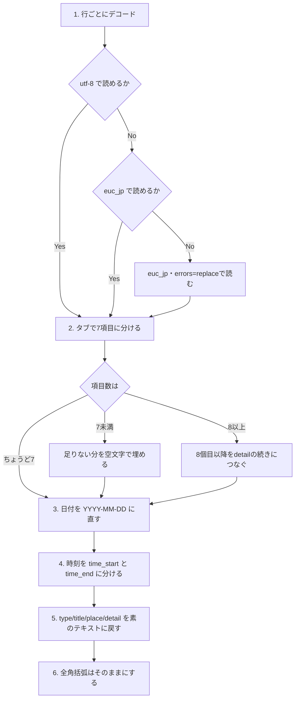

# データ形式

**状態: 実装済み。** 読み書きは JSON Lines で、移行ツール
（`ytsched migrate`）も入っている（TODO-020）。形式を決めた経緯は
`archives/todo/TODO-018. データ形式の見直し（何を変えるかを決める）.md`
にある。

## この文書について

ytsched がスケジュールを保存する形式の仕様。**形式を変えたら、この文書も
書き直す。** 「なぜそう決めたか」の記録は `archives/todo/` にあり、そちらは
現行仕様ではない。

関連文書: ソースコードの構成は [../src/README.md](../src/README.md)、
開発環境やコマンドは [Developer.md](Developer.md)、テストの構成は
[../tests/README.md](../tests/README.md)、利用者向けの説明は
[../README.md](../README.md) にある。

## ファイルの置き場所

データディレクトリ（既定は `~/ytsched/data`）の下に、1 日 1 ファイルで置く。

```
~/ytsched/data/
  2026/
    08/
      20.jsonl      # 2026-08-20 の予定
      21.jsonl
  ToDo.jsonl        # ToDo（日付ごとに分けない）
  conf.json         # 設定（この文書の対象外）
```

- 日々の予定は `{データディレクトリ}/{年}/{月}/{日}.jsonl`。年は 4 桁、
  月と日は 0 埋めの 2 桁
- ToDo は日付で分けず、`{データディレクトリ}/ToDo.jsonl` にまとめる。
  ToDo の `date` は締切を表す
- 1 日 1 ファイルのままにしたのは、1 つのファイルが壊れたときに影響が
  その日だけで収まるため。月ごとにまとめればファイルを開く回数は減るが、
  壊れたときの範囲が 1 か月に広がる

## 1 件の形

**1 行に 1 件を JSON で書く**（JSON Lines）。行の区切りは `\n`。

```json
{"sde_id": "3f2a…", "date": "2026-08-20", "time_start": "10:00", "time_end": "11:00", "type": "予定", "title": "会議（重要）", "place": "3F 会議室", "detail": "議題\n・進捗\n・来月の予定"}
{"sde_id": "9c81…", "date": "2026-08-25", "time_start": null, "time_end": null, "type": "□ToDo", "title": "報告書", "place": "", "detail": ""}
```

キーと値:

| キー | 型 | 内容 |
| --- | --- | --- |
| `sde_id` | 文字列 | 新しく作るものは UUID（`SchedDataEnt.new_id()` が発行）。**旧形式から移ってきたものは UUID ではない**（独自の形で、実データでは 13〜18 文字。大半は 17 文字か 18 文字だが、16 文字が 64 件、15 文字が 6 件、13 文字が 1 件ある）。移行で振り直さないので、両方が混ざる |
| `date` | 文字列 | `YYYY-MM-DD`。ToDo では締切 |
| `time_start` | 文字列 または null | `HH:MM`。時刻を決めていなければ null |
| `time_end` | 文字列 または null | `HH:MM`。同上 |
| `type` | 文字列 | 種別。先頭が `□` なら ToDo |
| `title` | 文字列 | 表題 |
| `place` | 文字列 | 場所 |
| `detail` | 文字列 | 本文。**改行もタブもそのまま持てる** |

- キー名は `SchedDataEnt` の属性名に合わせた。ファイルとコードの対応が
  そのまま読めるようにするため
- キーの並びは上の表の順に書く。読むときは順序を見ない
- **書くときは全部のキーを出す。読むときは欠けていてもよい。**
  欠けた `type` `title` `place` `detail` は空文字、`time_start`
  `time_end` は null として扱う。あとから項目を増やしても、古い行が
  そのまま読める
- `date` だけは必須。欠けている行や日付として読めない行は飛ばす
- 日々のファイルでは、ファイル名から決まる日付と行の `date` が同じに
  なるはずだが、読み込みは**行の `date` を使う**。食い違っていたら
  警告を出す（ファイル名を信じて黙って書き換えたりはしない）

## 文字コード

**utf-8 のみ。** 旧形式は utf-8 で読めなければ euc_jp で読み直していたが、
移行ツールで一度 utf-8 に揃えるので、読む側で判定しない。

日本語はエスケープせずそのまま書く（`json.dumps(…, ensure_ascii=False)`）。
エディタや `grep` でそのまま読める。

## 壊れた行の扱い

**行ごとに判断し、読めない行だけを飛ばす。ファイル全体は捨てない。**
飛ばしたときは警告を出す。

飛ばす行:

- 空行（空白だけの行を含む）
- utf-8 でデコードできない行
- JSON として読めない行
- オブジェクトでない行（配列や数値だけの行）
- `date` が無い、または日付として読めない行

旧形式では、末尾に空行が 1 つあるだけで、あるいは日付が 1 か所おかしい
だけで、その日のファイルが丸ごと読めなくなっていた（`ValueError` が
そのまま上へ抜けた）。さらに utf-8 でも euc_jp でも読めないバイトが
混じると 0 件として扱われ、**その状態で操作を 2 回すると元のデータが
消えた**（実測）。1 回目の保存で元のファイルが `.bak` へ退避され、本体は
新しく足した 1 件だけになる。次に何か足してもう一度保存すると、その
「1 件だけの本体」が `.bak` を上書きし、元のデータはどちらにも残らない。
（`save()` を続けて 2 回呼ぶだけでは起きない。1 回目で本体が空になり、
空のファイルは退避しないため。追加を挟んで 2 回保存すると起きる。）

行ごとに切り分けることで、壊れた 1 行につられて他の行を失わないようにする。

**飛ばした行のうち、空行を除く 4 種類は、次の保存でファイルの末尾へ
書き戻す。** 読み込みで飛ばした行は生のバイト列のまま覚えておき、
`save()` が予定の行を書いたあとに、**元のバイトのまま**末尾へ書き戻す。
したがって、保存を何回くり返しても壊れた行は失われず、本体にも `.bak`
にも残る。読み直すたびにまた飛ばされて警告も出続ける。上に書いた
「操作を 2 回すると元のデータが消えた」旧形式の問題は、これで起きない。

**空行だけは書き戻さない。** 飛ばしても失うデータが無いため、保存すると
ファイルから消える。手で編集して空行が紛れ込んでも、一度保存すれば
その行は消え、`empty line .. ignored` の警告も出なくなる。

書き戻した行は、利用者が `.jsonl` を手で直さない限り、読み直すたびに
また飛ばされて警告も出続ける。**手で直すときは、サーバを止めてから
直すか、直したあとにサーバを再起動すること。** `SchedData`
（アプリが 1 つだけ持つキャッシュ）は一度読んだ日付をプロセスが
生きている間ずっと覚えているため、サーバを動かしたまま直しても、
次にその日付へ追加・削除があると、キャッシュ側の内容で上書きされて
壊れた行が復活する。

## バックアップ

保存のたびに全件を書き直す。書く前に、既存のファイルが空でなければ
`.bak` を付けた名前へ退避する（例: `20.jsonl` → `20.jsonl.bak`）。
空のファイルを退避しないのは、`.bak` にしか残っていないデータを空で
上書きしないため。ここは旧形式から変えない。

## 「重要」「取り消し」「ToDo」の判定

**専用のフィールドを持たず、`type` と `title` の先頭で判定する。
ここは変えない。** 入力欄に決まった文字を打つだけで状態を切り替えられ、
決まった選択肢に縛られずに使えるため。

| 判定 | 見る場所 | 先頭が |
| --- | --- | --- |
| ToDo | `type` | `□` |
| 休日 | `type` | `休日` `祝日`（先頭ではなく一致） |
| 重要 | `title` | `(重要)` `!` `！` `★` `☆` |
| 取り消し | `title` | `(キャンセル` `(欠` `(中止` `(休` `(無効` `(不要` `x` |

## 判定・検索に使う正規化

**保存する文字列は入力されたまま変えない。** 判定と検索の照合をするときに
だけ、比べる用のコピーを作って揃える。

揃える内容は 2 つ。

1. 全角括弧を半角にする（`（` → `(`、`）` → `)`）
2. 小文字にする

これを使う場所は、「重要」「取り消し」の判定、並べ替えのキー
（`get_sortkey()` が表題の先頭の `(` を見る）、検索の照合対象
（`search_str()`）、それに**検索・絞り込みの入力文字列**の 4 か所。

旧形式では、この置換を**読み込みのたびに文字列そのものへ**かけていた。
そのため次の食い違いが起きていた（実測）。

```
（重要）打合せ  入力直後: 重要=False  →  保存して読み直すと: 重要=True
```

入力直後のオブジェクトは置換を通っていないので判定が効かず、ファイルから
読み直すと効く。表示も `（重要）打合せ` が `(重要)打合せ` に変わっていた。
判定のときだけ揃えれば、入力したとおりに表示され、判定はどちらの括弧でも
同じように効く。

`unicodedata.normalize("NFKC", …)` は使わない。`㍿` を `株式会社` に、
`①` を `1` に変えるところまで及び、旧形式が置換していた範囲より広くなる。
検索で `㍿` と打っても当たらなくなるなど、予想しにくい影響が出る。

**検索・絞り込みの文字列（利用者が入れる正規表現）も、同じ
`normalize()` を通す**（TODO-029）。画面に見えているとおりに `（重要）` と
打てば、`会議（重要）` に当たる。`conf.json` へ保存する値も、入力欄に
出る値も、正規化したあとのものになる。

ただし、**全角括弧は半角になるので、正規表現のグループとして解釈される。**
`（重要）` は `(重要)` として扱われ、括弧そのものは照合されない（`重要` に
当たる）。括弧の文字そのものを探したいときは `\(` `\)` と打つ。

TODO-029 の前は、入力側だけ小文字化しかしていなかった。旧形式は保存する
文字列そのものが半角になっていたので見えているとおりに打てば当たったが、
新形式では全角のまま保存するので、表示と検索が食い違っていた。

## 旧形式（タブ区切り）からの移行

旧形式は、`.cgi` という拡張子のタブ区切りテキストだった。

```
3f2a…	2026/08/20	10:00-11:00	予定	会議（重要）	3F 会議室	議題<br />・進捗
```

### 対象にするファイル

`{年}/{月}/{日}.cgi` と `ToDo.cgi` だけを移す。同じディレクトリにある
`{日}-backup.cgi`、`{日}.cgi.bak` は過去の版で、中身は同じ 7 列だが
移行の対象にしない（移すと同じ予定が二重になる）。`iappli_log.cgi` などは
そもそも別系統で、列の数からして違う。

移行ツールは、設定ファイルを `Conf.cgi` から `conf.json` へ変換する
処理も兼ねる（TODO-032）。設定はこの文書の対象外なので、形式の詳細は
`src/README.md` にある。

### 実データを調べて分かったこと

手元の既存データを調べた結果。**断りがなければ日々のファイル
（`{年}/{月}/{日}.cgi`、6733 ファイル・13361 行）についての数字**で、
`ToDo.cgi`（utf-8 の 1 ファイル・9 行）は別に確かめてある。

- **7 列でない行は無かった。** 日付が読めない行も、ファイル名の日付と行の
  `date` が食い違う行も無かった
- 文字コードは utf-8 が 2111 ファイル、euc_jp が 4430、空が 179。
  **どちらでも読めないファイルが 13 件**（下の手順 1）
- `sde_id` は 13352 種類で、8 種類が重複していた（最大 3 回）
- `type` が `□` で始まる行（ToDo）は日々のファイルには 1 行も無く、
  `ToDo.cgi` に 9 行だけあった
- `title` が空の行が 1148 行あった
- `detail` に `<br />` が 4711 行、`&nbsp;` が 1035 行、`&amp;` が 546 行、
  `<br />` 以外の HTML タグが 13 行
- 時刻が `28:00` の行が 1 件（下の手順 4）
- **`detail` に U+2028（LINE SEPARATOR）が 1 件あった。** 行に分けるときは
  `split("\n")` を使う。`str.splitlines()` は U+2028 でも切るので、この
  1 件が 2 行に割れて壊れる（前半が `sde_id` 1295 文字の行、後半が
  6 列の行になる）

### 変換の手順

移行ツールで一度に変換する。両方を読めるようにはしない。分岐まで含めて
図にすると次のようになる（番号は下の説明の番号と対応する）。



変換でやること:

1. **行ごとにデコードする。** 1 行を utf-8 で読み、だめなら euc_jp で
   読む。どちらでも読めない行は euc_jp の `errors="replace"` で読み、
   読めなかった文字だけを U+FFFD にして**行は残す**。

   **ファイル単位でデコードしない。** 旧コードはファイルごとに
   utf-8 → euc_jp と試し、どちらも失敗すると 0 件を返していた。実データで
   これに当たるファイルが 13 件あったが、**そのすべてで壊れていたのは
   1 行だけ**で、同じファイルの他の 33 行は euc_jp で読めた。壊れた 13 行
   自体も 7 列として成立し、日付も読め、読めないのは `detail` と `place` の
   2〜16 文字だけだった。行ごとに読めば **1 行も失わずに移せる**

   **行末の `\r` は落とす**（TODO-029）。行は `\n` で切るので、CRLF の
   ファイルでは最後の項目（`detail`）の末尾に `\r` が残る。旧形式では
   テキストモードの読み込みで消えていたので、移行で新しく入れない
2. タブで 7 つに分ける。`sde_id` `date` `時刻` `type` `title` `place` `detail`
   の順。**項目の数が合わない行がある。**7 個に満たなければ足りない分を
   空文字で埋める。8 個以上あれば、8 個目から先は `detail` の続きと
   みなしてタブでつなぎ直す（旧形式は本文のタブを空白に潰していたので
   本来は増えないが、手で編集した行などで増えていることがある。旧
   コードは 8 個目から先を捨てていた。移行では取りこぼさない）。
   **手元の実データにはこれに当たる行は無かった**が、念のため
3. 日付 `YYYY/MM/DD` を `YYYY-MM-DD` に直す
4. 時刻 `HH:MM-HH:MM` を `time_start` と `time_end` に分ける。
   `:-:` `HH:MM-:` `:-HH:MM` のように空の側は null にする。
   **範囲外の値は旧コードと同じく時を 24、分を 60 で割った余りにする**
   （実データに `28:00` が 1 件あり、旧コードはこれを `04:00` として
   読んでいた。移行でも同じにして、見え方を変えない）
5. `type` `title` `place` `detail` を素のテキストに戻す。**順番が大事**で、
   次の 3 つをこの順に行う。

   1. `<br />` を改行にする（大文字・小文字、スラッシュの有無は問わない）
   2. `html.unescape()` を **2 回**かける
   3. NBSP（U+00A0）を半角空白にする

   **2 回かけるのは、実データが二重にエスケープされているため。**
   `&amp;#160;` が 2205 個（`detail` に 2105 個、残りは主に `place`）
   あり、これは `&#160;`（NBSP）がもう一度
   エスケープされたもの。旧コードも変換表の先頭に `&amp;#160;` → 空白 を
   置いて、この形を直していた。**3 回以上はかけない**（`&amp;amp;amp;`
   のような連なりで、書いた人の意図を壊す）。

   **旧コードの `htmlstr2text()` を流用しない。**全角括弧の半角化まで
   一緒にやってしまい、次の手順 6 を破る。

   **`<br />` 以外の HTML タグはそのままにする**（実データに 13 行）。
   `base.html` のエスケープを切ったままなので、画面での見え方は変わらない。
6. **全角括弧はそのままにする。** 半角へ寄せるのは判定のときだけになった

変換できない行（日付が読めないなど）は、捨てずに書き出して報告する。

### 移行ツールの使い方

CLI のサブコマンド `ytsched migrate` として実装した。

```sh
uv run ytsched migrate --datadir ~/ytsched/data
```

| オプション | 内容 |
| --- | --- |
| `--datadir` | データディレクトリ。既定は `SchedDataFile.DEF_TOP_DIR`（`~/ytsched/data`） |
| `--dry-run` | 書き出さずに、変換できる件数だけ数えて出す |
| `--error-file` | 変換できなかった行の書き出し先。既定はカレントディレクトリの `migrate-errors.txt` |
| `--debug` / `-d` | デバッグログを出す |

- 予定データの対象は「対象にするファイル」に挙げた
  `{年}/{月}/{日}.cgi` と `ToDo.cgi` だけ。これに加えて、設定ファイル
  `Conf.cgi` を `conf.json` へ変換する（TODO-032）
- **元の `.cgi` は消さない。** 変換先の `.jsonl`（`Conf.cgi` なら
  `conf.json`）と並んで残る
- **既に `.jsonl` があるファイルは、警告して飛ばす**（上書きしない）。
  途中で失敗しても、もう一度実行すれば残りだけが変換される。
  `conf.json` も同じ扱い
- **アプリを起動する前に移行する。** 画面で絞り込みなどを変えると
  `conf.json` が新しく作られ、そのあとは既にあるものとして飛ばされる
  ので、旧 `Conf.cgi` の設定を取り込めなくなる
- 変換できない行は `--error-file` へ `{元のパス}:{行番号}\t{元の行}` の
  形で書き出す（変換できない行が 0 件ならファイルは作らない）。
  `--dry-run` のときはエラーファイルも書かない。**`Conf.cgi` の行は
  ここに出さない**（下記）
- 終わりに、変換したファイル数・飛ばしたファイル数・変換した行数・
  飛ばした行数（空行／変換できず、の内訳つき）と、設定ファイルの
  変換／飛ばした数を出す
- `Conf.cgi` でタブの無い行は、警告を出して飛ばす。予定データと違い
  `--error-file` へは書き出さない（設定はアプリが書いたもので、行数も
  数行のため）

### 移行のあとで画面の見え方が変わらないか

旧形式で画面に見えていた文字列は、**`htmlstr2text()` の結果を、ブラウザが
実体参照を 1 回デコードしたもの**だった（`base.html` が
`` なので、ファイルに残っていた `&quot;` などは
ブラウザ側で解かれていた）。新形式は素のテキストをそのまま出すので、
その 1 回分を移行時に済ませておく必要がある。上の手順はそうしてある。

手元の実データで確かめたところ、**53628 項目のうち 53460 項目が、旧形式で
画面に見えていた文字列と完全に一致した**（日々のファイル 13407 行 ×
`type` `title` `place` `detail` の 4 項目。`ToDo.cgi` の 36 項目も同じ
方法で確かめ、差は 0 件だった）。違ったのは 168 項目で、内訳はすべて
意図した変更だった。

| 違い | 件数 |
| --- | --- |
| 全角括弧をそのまま残した（手順 6） | 157 |
| `&amp;#12316;` などが `〜` `‼` `✨` に戻った | 7 |
| NBSP が半角空白になった | 4 |

**この 3 行は重なりのある分け方**で、157 のうち 5 項目は数値文字参照の
戻し（手順 5）も同時に効いている。原因ごとに重ならないよう数え直すと、
全角括弧だけ 152、数値文字参照だけ 7、両方 5、NBSP だけ 4 になる。
合計は 168 で変わらない。

想定していなかった違いは無かった。3 つのどれにも当てはまらない項目は
0 件だった。

### 変換元のテストデータ

移行ツールを作るには、変換元の実データか、代表的なサンプルが要る。
実データは個人の予定そのものなのでリポジトリに入れられない。

**合成のテストデータを `tests/data/old_format/` に用意した**（TODO-019）。
上に挙げた特徴を一通り含み、中身は架空。`tests/make_test_data.py` が
生成する。どのファイルが何を再現しているかは、そのディレクトリの
`README.md` にある。

## 選ばなかった案

- **タブ区切りのまま、エスケープ規則を足す。** タブと改行を `\t` `\n` の
  ような書き方に決めれば、いまの壊れ方（本文のタブが空白に潰れる、表題に
  タブが入ると列がずれて場所に化ける）は直せる。ただし自前のパーサを
  持ち続けることになり、列が固定なので項目を増やしにくい。既存データに
  `\t` という 2 文字が入っていれば、そこで化ける
- **日ごとの JSON 配列。** ファイル 1 つが 1 つの JSON になる。読み書きは
  1 回で済むが、1 文字壊れるとその日が丸ごと読めなくなる。旧形式と同じ
  弱さが残る
- **SQLite。** 検索が最大 1825 ファイルの走査から 1 回の問い合わせになり、
  更新も安全になる。ただし日付ごとにファイルを置く構成と `.bak` の
  仕組みを全部作り直すことになり、中身を `grep` やエディタで見られなく
  なる。予定は 1 日に数件で、日付ごとの読み込みには LRU のキャッシュが
  効いており、いま速さで困っていない
- **TOML。** 書き出しに標準ライブラリの機能が無く、依存が増える。
  設定ファイルでも同じ理由で見送り、JSON の `conf.json` にした
  （TODO-032。見送った経緯は
  `archives/todo/TODO-011. 設定ファイル Conf.cgi の形式（対応しない）.md`）

## 補足

`base.html` は `` のままなので、`title` や `detail` に
HTML を書くと画面に効く。形式を変えてもここは変わらない。単一利用者で
自分の入力しか自分に見えないため、現状のままと決めている（TODO-012）。
