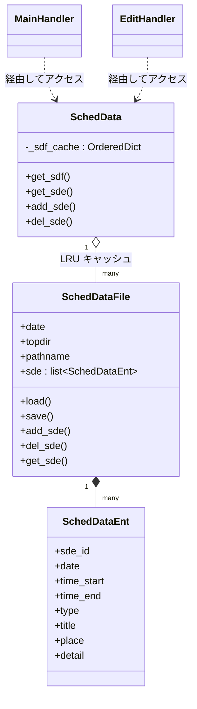
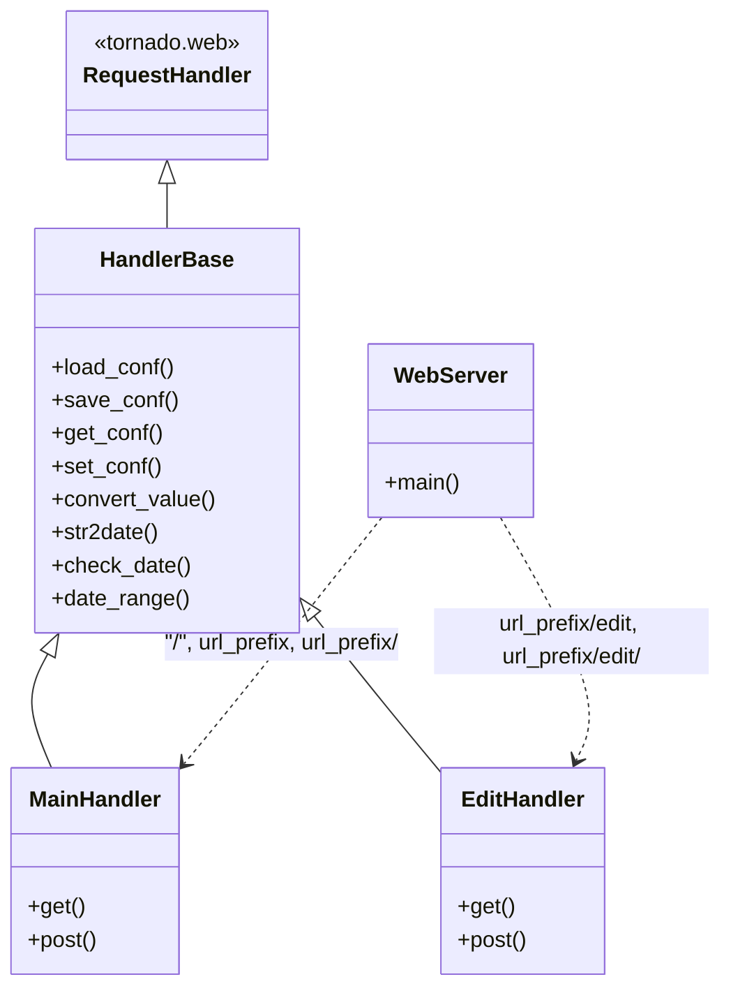
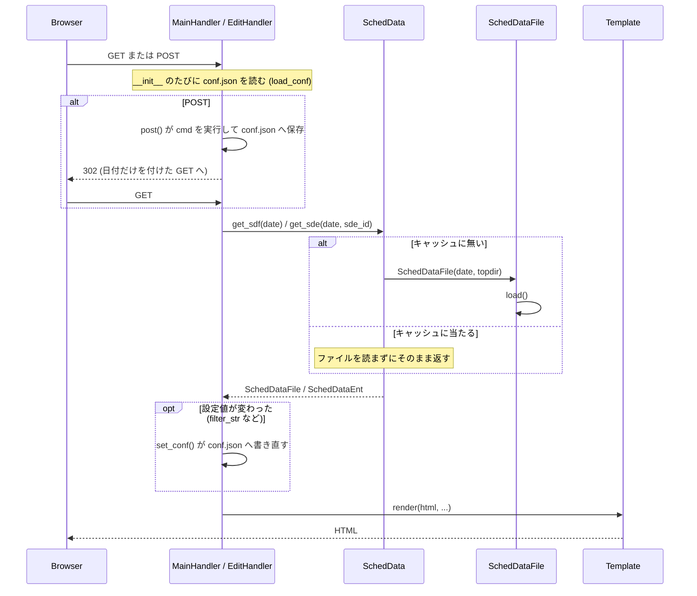

# ソースコードの構成

`src/ytsched/` の構成と、クラス同士の関係をまとめる。個別のメソッドの
引数や挙動は、コード中の docstring を読めば分かるので、ここには書かない。
利用者向けの説明は [../README.md](../README.md)、開発環境やコマンドは
[../docs/Developer.md](../docs/Developer.md)、テストの構成は
[../tests/README.md](../tests/README.md) を見ること。

## モジュール一覧

```
src/ytsched/
  ytsched.py       # データモデル: SchedDataEnt / SchedDataFile / SchedData
  handler.py       # HandlerBase（tornado.web.RequestHandler の共通部分、conf.json の読み書き、引数の変換と検証）
  main_handler.py  # MainHandler（一覧表示・追加/修正/削除の実行）
  edit_handler.py  # EditHandler（編集画面）
  webapp.py        # WebServer（tornado.web.Application の組み立て、CLI から呼ばれる）
  migrate.py       # 旧形式（タブ区切り .cgi）から JSON Lines への移行と、設定ファイルの JSON 化（`ytsched migrate`）
  mylog.py         # loguru ラッパ
  click_utils.py   # click の共通オプション（`-h` / `-d` / `-V` `-v`）をまとめたデコレータ
  __main__.py      # click による CLI（`ytsched` コマンド）
  webroot/
    templates/      # tornado のテンプレート（base/main/edit/sde.html）
    static/         # CSS・JS・favicon
```

CLI には `webapp`（Web サーバ、本来の入口）と `migrate`（旧形式からの
移行）のほかに、`x_data1` というデバッグ用のサブコマンドが残っている
（指定した 1 日分のデータを標準出力へダンプするだけで、`webapp` の
動作には関係ない）。

`-h` / `--help`、`-d` / `--debug`、`-V` / `-v` / `--version` は、
`click_utils.py` の `click_common_opts()` がグループと全サブコマンドに
付ける（TODO-036）。このデコレータは `click.pass_context` も付けるので、
**コマンド関数の第 1 引数は `ctx`** になる。グループ側の `--debug` は
`ctx.obj` に入れてサブコマンドへ引き継ぎ、`__main__.py` の `_is_debug()`
でサブコマンド自身の `--debug` とまとめている（`ytsched --debug migrate`
でも `ytsched migrate --debug` でも DEBUG が出る）。

## データモデル: `SchedDataEnt` / `SchedDataFile` / `SchedData`

3 つのクラスが `ytsched.py` に入っていて、下から上へ積み上がっている。
関係を図にすると次のようになる。



- **`SchedDataEnt`** が予定・ToDo 1 件を表す。`sde_id`（UUID）、`date`、
  `time_start`/`time_end`、`type`、`title`、`place`、`detail` を持つ。
  `detail` は常に素のテキスト（改行・タブもそのまま持てる）で、保存・
  読み込みで文字列を変換しない。**画面の改行表示は CSS の
  `white-space: pre-wrap` が担っている**（テンプレート側でタグを
  差し込んでいるわけではない）
- **`SchedDataFile`** が 1 ファイル（1 日分、または ToDo 全体）の
  読み書きを担う。パスの決め方は `date2path()` が担う。規則は
  [../docs/data-format.md](../docs/data-format.md) にある
- **`SchedData`** が `SchedDataFile` を日付ごとにキャッシュする
  （`OrderedDict` で LRU 的に古いものから捨てる）。`MainHandler` /
  `EditHandler` はここを経由してデータへアクセスし、`SchedDataFile` を
  直接は触らない

データの中身の仕様（保存形式、壊れた行の扱い、`normalize()` による
「重要」「取り消し」の判定など）は
[../docs/data-format.md](../docs/data-format.md) にまとめてある。

## Web ハンドラ: `HandlerBase` / `MainHandler` / `EditHandler`

継承関係と、`WebServer` がどの URL にどちらを割り当てているかを
図にすると次のようになる。



- **`HandlerBase`**（`handler.py`）が `tornado.web.RequestHandler` の
  共通部分。リクエストのたびにデータディレクトリ直下の設定ファイル
  `conf.json` を読み書きする（`load_conf()` / `save_conf()` /
  `get_conf()` / `set_conf()`）。JSON のオブジェクト 1 つで、値は
  すべて文字列（TODO-032）。人が手で編集するファイルではない。
  読めない設定ファイル（壊れた JSON、オブジェクトでない、値が文字列
  でないキー）は、警告を 1 行出して無視する。
  引数や設定値の変換と検証もここに置く（`convert_value()` /
  `str2date()` / `check_date()` / `date_range()` / `check_int_range()`。
  TODO-027）
- **`MainHandler`**（`main_handler.py`）が一覧表示と、追加・修正・削除の
  実行（`cmd=add/fix/update/del`）を兼ねる。**`GET` が描画、`POST` が
  実行**で、`post()` は描かずに `redirect()` する（POST-Redirect-GET、
  TODO-050）。リロードで再送信にならないようにするため。`cmd` を
  実行するのは `post()` だけで、`GET` に `cmd` を付けても効かない。
  **URL に持たせるのは日付だけ**（`?date=2026-08-24`）。検索語・
  絞り込み・ToDo の日数・目標件数は `conf.json` に保存する。
  それらを送るときは、ブックマークや履歴に残らないよう `POST` を通す
  （`my.js` の `doPost()`。表示を変えるだけの移動は `doGet()`）
- **`EditHandler`**（`edit_handler.py`）が編集画面を出す。`date` /
  `sde_id` の決め方（引数 → クエリ文字列 → 既定値の順）は docstring に
  書いてある。フォームの隠しフィールド `orig_date`（更新・削除のときに
  見に行くファイルの日付）は、テンプレートではなく handler が決める
  ＝ **その `sde` を読み込んだファイルの日付**（ToDo は `None`。
  TODO-029）。新規（`sde_id` 無し）のときは、まだどのファイルにも
  入っていないので**表示している日付**にする（`None` にすると、
  新規の画面で `fix` を押したときに `ToDo.jsonl` を開いて `.bak` まで
  作る道が開く）

`WebServer`（`webapp.py`）がこの 2 つを `tornado.web.Application` に
組み立てる。URL は既定で `/ytsched`（`WebServer.DEF_URL_PREFIX`）配下。

## リクエストが来てから画面が出るまでの流れ

`MainHandler`/`EditHandler` に共通の、リクエスト 1 回の流れを図にすると
次のようになる。クラス図だけでは分からない「時間の流れ」を示すためのもの
なので、クラス同士の関係は上の図を見ること。



## フィルタ・検索文字列の扱い

利用者の入力を正規表現として扱う（利用者本人しか使わないアプリという
前提）。`MainHandler.get()` の中で 1 回だけコンパイルし、**不正なら
その条件を無視して全件を出す**。不正な文字列でも入力欄と `conf.json` から
消さず、マッチに使うかどうかだけを分けている。`filter_str` も
`search_str` も、照合される側（`SchedDataEnt.search_str()`）と同じ
`normalize()` を通してから `conf.json` へ保存する（TODO-029。全角括弧の
扱いは [../docs/data-format.md](../docs/data-format.md) にある）。検索
モードかどうかは「文字列が空でないか」ではなく「コンパイルできたか」で
判定する（`search_mode`）。

## テンプレートの autoescape

`base.html` は `` のまま（エスケープを切っている）。
単一ユーザ・自分の入力しか自分に見えないため実害が無いと判断し、現状
維持と決めている。
